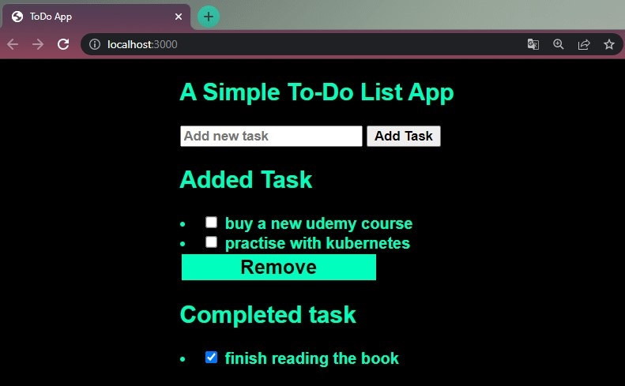

<!-- <div align="center" id="top"> 
  

  &#xa0;

</div> -->

<h1 align="center">To Do Web App served with Node.js and Express.js</h1>

<p align="center">
  
  
  
  
  
  
  
  
  <!--  -->
  <!--  -->
  <!--  -->
</p>

<!-- Status -->

<!-- <h4 align="center"> 
	🚧  Dummy Nodejs Todo 🚀 Under construction...  🚧
</h4> 

<hr> -->

<p align="center">
  <a href="#dart-about">About</a> &#xa0; | &#xa0; 
  <a href="#sparkles-features">Features</a> &#xa0; | &#xa0;
  <a href="#rocket-technologies">Technologies</a> &#xa0; | &#xa0;
  <a href="#white_check_mark-requirements">Requirements</a> &#xa0; | &#xa0;
  <a href="#checkered_flag-starting">Starting</a> &#xa0; | &#xa0;
  <a href="#memo-license">License</a> &#xa0; | &#xa0;
  <a href="https://github.com/devenes" target="_blank">Author</a>
</p>

<br>

## :dart: About ##

Simple To Do application built with Node.js and Express.js that lets you add tasks on a single page, store new and finished tasks in different arrays. Containerized with Docker and tested with NPM through GitHub Actions pipeline.
## :sparkles: Features ##

:heavy_check_mark: **Add tasks** \
:heavy_check_mark: **Store tasks** \
:heavy_check_mark: **Delete tasks** 

## :rocket: Technologies ##

The following tools were used in this project:

- [Node.js](https://nodejs.org/en/)
- [Javascript](https://www.javascript.com/)
- [Express.js](https://expressjs.com/)
- [Docker](https://www.docker.com/)
- [NPM](https://www.npmjs.com/)
- [Body-parser](https://www.npmjs.com/package/body-parser)
- [EJS](https://www.npmjs.com/package/ejs)
- [CSS](https://www.w3schools.com/css/default.asp)

## Embedded Javascript

EJS simply stands for Embedded Javascript. It is a simple templating language/engine that lets its user generate HTML with plain javascript. EJS is mostly useful whenever you have to output HTML with a lot of javascript. EJS is a simple templating language that lets you generate HTML markup with plain JavaScript. No religiousness about how to organize things. No reinvention of iteration and control-flow.

## Body-Parser

Body-Parser is the Node. js body parsing middleware. It is responsible for parsing the incoming request bodies in a middleware before you handle it. This extracts the entire body portion of an incoming request stream and exposes it on req.body

## :white_check_mark: Requirements ##

Before starting :checkered_flag:, you need to have [Git](https://git-scm.com) and [Node](https://nodejs.org/en/) installed.

## Output




## :checkered_flag: Starting ##

```bash
# Clone this project
git clone https://github.com/devenes/node-js-dummy-test

# Access
cd node-js-dummy-test

# install all needed dependencies
npm install

# Start the app in the browser
npm start

# The server will initialize in the <http://localhost:3000>
```


## Test App

Run <code> npm test </code> to run the tests


## Build Docker Image with Dockerfile

Use the following commands in your `Dockerfile` to build a Docker image:

```dockerfile
FROM node:16-alpine
WORKDIR /app
COPY package*.json .
RUN npm install
COPY . .
EXPOSE 3000
CMD ["npm", "start"]
```


## Containerization with Docker using GitHub Actions

Create your own GitHub Actions workflow to build your Docker image and push it to DockerHub. Name your workflow file as <code> dockerx.yml </code> and add the following steps:

```yml
name: Docker Deployment

on:
  push:
    branches:
      - "release"

  pull_request:
    branches:
      - "release"

jobs:
  dockerx:
    runs-on: ubuntu-latest
    steps:
      - name: Set up QEMU
        uses: docker/setup-qemu-action@v1

      - name: Set up Docker Buildx
        uses: docker/setup-buildx-action@v1

      - name: Login to DockerHub
        uses: docker/login-action@v1
        with:
          username: ${{ secrets.DOCKERHUB_USERNAME }}
          password: ${{ secrets.DOCKERHUB_PASSWORD }}

      - name: Build and push
        uses: docker/build-push-action@v2
        with:
          push: true
          tags: ${{ secrets.DOCKERHUB_USERNAME }}/todo-nodejs-vx:${{github.run_number}}
```

## Test Your Code with GitHub Actions

Create your own GitHub Actions workflow to test your code. Name your workflow file as <code> node.js.yml </code> and add the following steps:

```yml
name: Node.js CI Test

on:
  push:
    branches:
      - "*"

  pull_request:
    branches:
      - "*"

jobs:
  build:
    runs-on: ubuntu-latest

    strategy:
      matrix:
        node-version: [12.x, 14.x, 16.x]

    steps:
      - uses: actions/checkout@v3

      - name: Use Node.js ${{ matrix.node-version }}
        uses: actions/setup-node@v3
        with:
          node-version: ${{ matrix.node-version }}
          cache: "npm"

      - run: npm ci

      - run: npm run build --if-present

      - run: npm test
```

## Resources

- [Using workflow run logs](https://docs.github.com/en/actions/monitoring-and-troubleshooting-workflows/using-workflow-run-logs)

- [Understanding GitHub Actions](https://docs.github.com/en/actions/learn-github-actions/understanding-github-actions)

- [Node.js](https://www.yusufsezer.com.tr/node-js-npm/)

- [Todo App with Node.js](https://medium.com/@atingenkay/creating-a-todo-app-with-node-js-express-8fa51f39b16f)

- [npm-run-script](https://docs.npmjs.com/cli/v8/commands/npm-run-script)

- [npm-test](https://docs.npmjs.com/cli/v8/commands/npm-test)

- [npm](https://www.npmjs.com/)


## :memo: License ##

This project is under license from Apache 2.0. For more details, see the [LICENSE](LICENSE) file.


Made with :heart: by <a href="https://github.com/devenes" target="_blank">devenes</a>

&#xa0;

<a href="#top">⬆️ Back to top</a>
